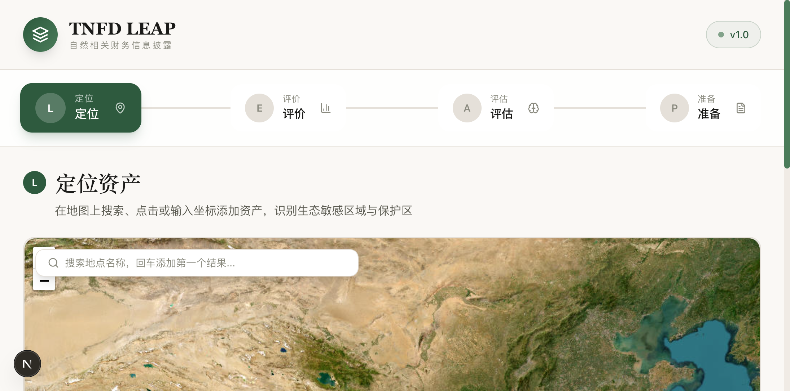
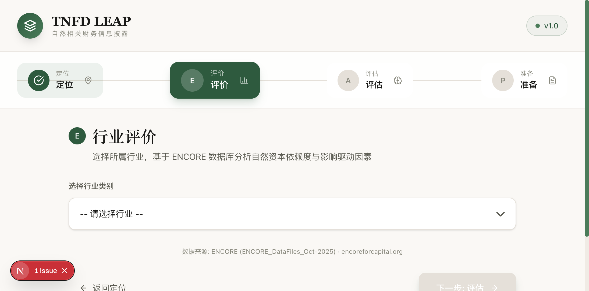

# TNFD LEAP Framework

> 自然相关财务信息披露自动化工作台 | Nature-related Financial Disclosure Tool

[](https://github.com/newversionparty-cn/-)
[](https://opensource.org/licenses/MIT)

## 项目简介

TNFD LEAP 是基于 **TNFD v1.0 框架** 和 **LEAP 方法论**（Locate → Evaluate → Assess → Prepare）构建的自动化披露工具，帮助中国 NGO 和中小企业快速完成自然相关财务信息披露。

## 界面预览

| L - 定位资产 | E - 行业评价 |
|:---:|:---:|
|  |  |

> **A（评估）** 和 **P（准备）** 需完成前置步骤后访问，运行 AI 分析后生成 TNFD 风险报告与 PDF 导出功能

## 核心功能

| 步骤 | 模块 | 说明 |
|------|------|------|
| **L** | 定位资产 | CSV 批量上传 / 地图搜索 / 点击选点，自动识别保护区（WDPA） |
| **E** | 行业评价 | 基于 ENCORE 数据库，分析行业自然资本依赖度与影响驱动因素 |
| **A** | AI 评估 | Qwen 大模型推理，输出 TNFD 风险与机遇分析报告 |
| **P** | 报告生成 | 一键导出符合 TNFD v1.0 框架的 PDF 披露报告 |

## 项目结构

```
tnfd/
├── src/                    # Next.js 前端应用
│   ├── app/               # App Router 页面
│   ├── components/leap/  # LEAP 各步骤组件
│   └── store/            # Zustand 状态管理
├── backend/              # Python FastAPI 后端（可选）
│   ├── services/         # 业务服务
│   └── main.py           # API 入口
├── data/                 # 数据文件
│   └── raw/encore_data.zip  # ENCORE 原始数据
├── docs/                 # 项目文档
│   ├── 部署方案.md       # 部署指南
│   └── 数据源清单.md     # 数据源参考
├── public/screenshots/    # 界面截图
└── docker-compose.yml     # Docker 部署配置
```

## 快速开始

### 前端仅运行（推荐）

```bash
git clone https://github.com/newversionparty-cn/-.git
cd -
npm install
npm run dev
# 打开 http://localhost:3000
```

### Docker 完整部署（前端 + 后端）

```bash
# 设置 Qwen API Key
export QWEN_API_KEY=your_api_key

# 启动所有服务
docker-compose up -d

# 访问
# 前端: http://localhost:3000
# 后端: http://localhost:8000
```

### 本地 Python 后端（可选）

```bash
cd backend
pip install -r requirements.txt
uvicorn main:app --reload --port 8000
```

## 技术栈

| 层级 | 技术选型 |
|------|---------|
| 前端框架 | Next.js 16 + TypeScript + App Router |
| 样式 | Tailwind CSS + 自定义设计系统 |
| 状态管理 | Zustand |
| 地图 | react-leaflet + ESRI 底图 |
| 数据解析 | PapaParse (CSV) |
| AI 对接 | Qwen（阿里云百炼兼容 OpenAI SDK） |
| PDF 导出 | html2pdf.js |
| 后端（可选） | Python FastAPI + uvicorn |

## 数据来源

| 数据源 | 用途 | 许可 |
|--------|------|------|
| [ENCORE Database](https://encoreforcapital.org/) | 行业依赖/影响分析 | CC BY-SA 4.0 |
| [WDPA](https://www.protectedplanet.net/) | 保护区空间叠加 | CC BY-NC 4.0 |
| [ESRI World Imagery](https://www.esri.com/) | 地图底图 | 免费使用 |

> 完整数据源清单请参考 [数据源清单](docs/数据源清单.md)

## 数据隐私

本工具处理的所有数据均在**本地浏览器**中完成，API 调用使用阿里云百炼服务，数据不出境。

## 部署文档

- [部署方案](docs/部署方案.md) — Vercel + Railway / 阿里云 ECS / 本地部署
- [数据源清单](docs/数据源清单.md) — 核心数据源及中国本土数据推荐

## 免责声明

风险评估结果由 AI 模型生成，仅供参考。实际披露前建议咨询专业 ESG 顾问或依据 TNFD 官方指南进行人工复核。

---

MIT License · 用爱开发，为地球所用
